# ALB Multi-AZ projekt
# AWS ALB Multi-AZ Web Application
 
I built a highly available web architecture on AWS using an Application Load Balancer and a multi-AZ VPC. The EC2 instances are placed in private subnets so they aren't directly exposed to the internet, relying on a NAT Gateway just for outbound updates. I set up strict security groups to keep the public and private tiers isolated and followed least-privilege principles. I configured everything manually in the AWS Console to make sure I fully understood the underlying networking and routing. 

After building it, I tested the fault tolerance by stopping instances across different availability zones, checked the target group health statuses, and ran terminal curl requests to verify the load balancer was distributing traffic correctly.
 
---
 
## Architecture Diagram
 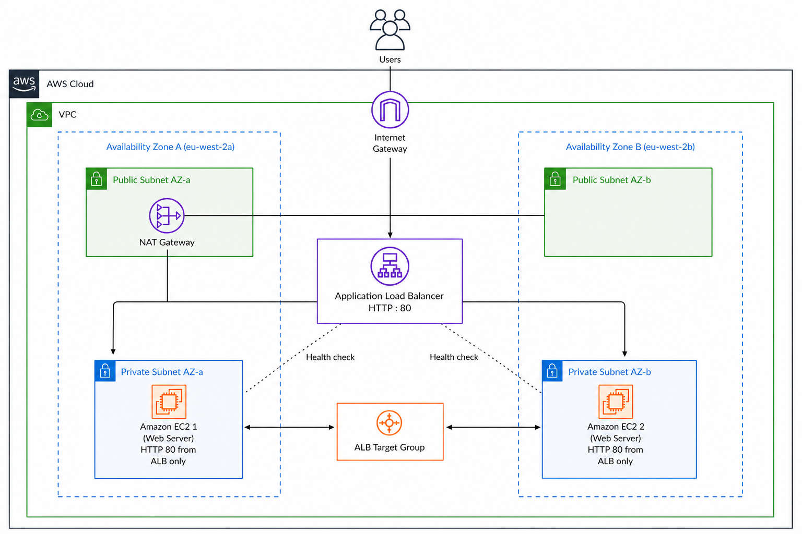

 
---
 
 
## Step 1 – VPC Creation
 
**Purpose**
Create an isolated network boundary to host all application resources.
 
**What was configured**
- Custom VPC created with CIDR block `10.1.0.0/16`
- DNS support enabled
- VPC named `alb-vpc`
**Why this matters**
A `/16` CIDR provides sufficient address space for subnet segmentation across both public and private tiers, while establishing full control over networking and routing from the ground up.
 
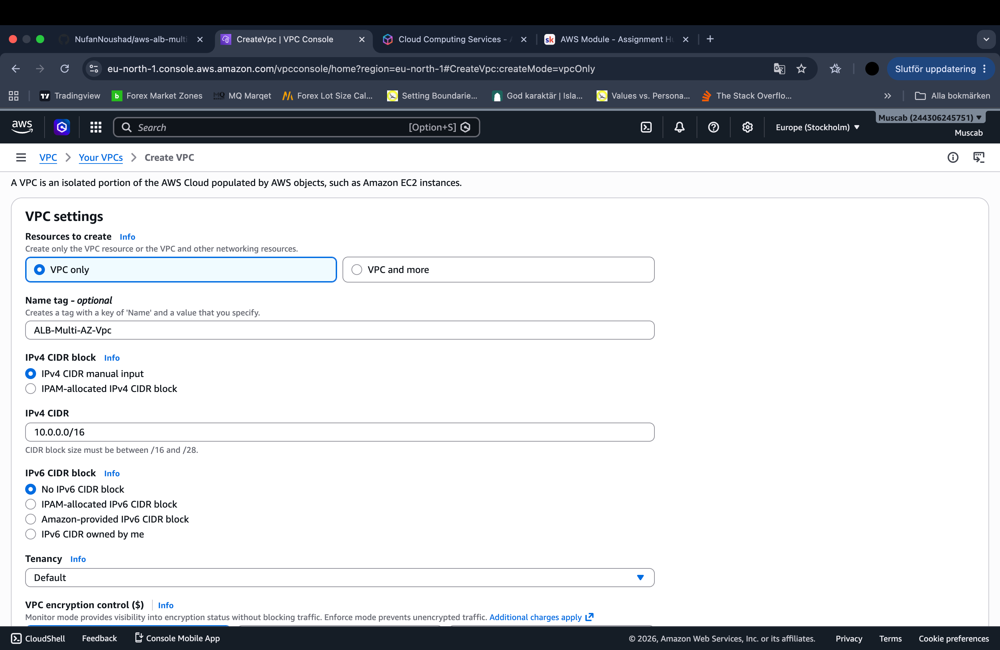
 
---
 
## Step 3 – Public Subnet Creation (Multi-AZ)
 
**Purpose**
Create public subnets to host internet-facing components — the Application Load Balancer and the NAT Gateway.
 
**What was configured**
- Public subnet in AZ-a: `10.1.1.0/24`
- Public subnet in AZ-b: `10.1.2.0/24`
- Auto-assign public IPv4 enabled on both subnets
**Why this matters**
An Application Load Balancer requires subnets in at least two Availability Zones — this is an AWS hard requirement, not a design choice. Spreading the public tier across both zones is also what allows the NAT Gateway and ALB to remain reachable if one zone experiences an outage.
 
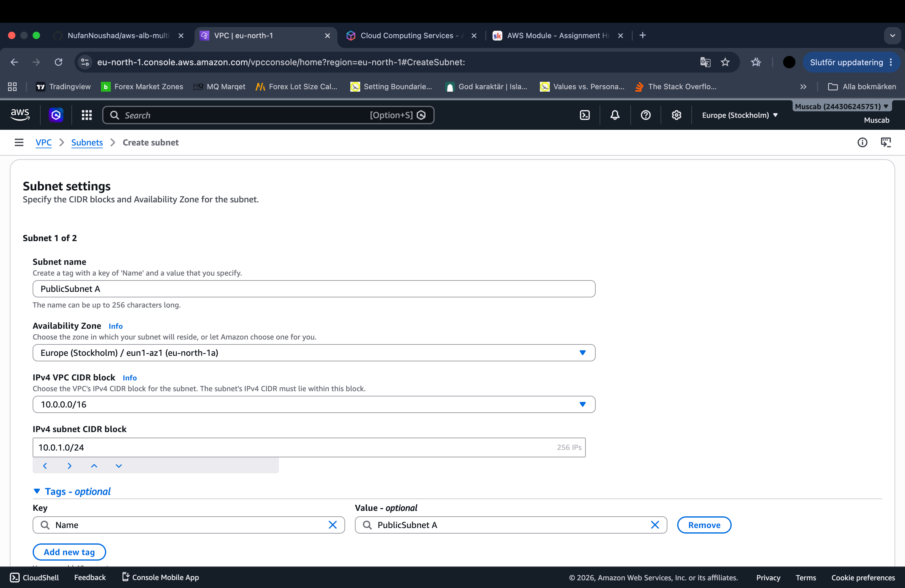
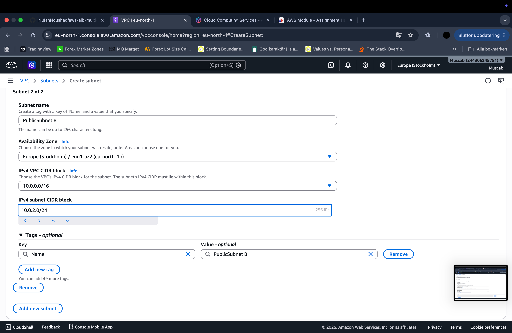
 
---
 
## Step 4 – Private Subnet Creation (Multi-AZ)
 
**Purpose**
Create isolated subnets for the application instances so they are never directly reachable from the internet.
 
**What was configured**
- Private subnet in AZ-a: `10.1.11.0/24`
- Private subnet in AZ-b: `10.1.12.0/24`
- No public IP assignment on either subnet
**Why this matters**
Removing the public IP entirely — rather than relying on a security group alone — means there is no address for an external request to even attempt a connection to. This is a stronger guarantee of isolation than a security group rule by itself, since it removes the path in at the network layer rather than just filtering it.
 
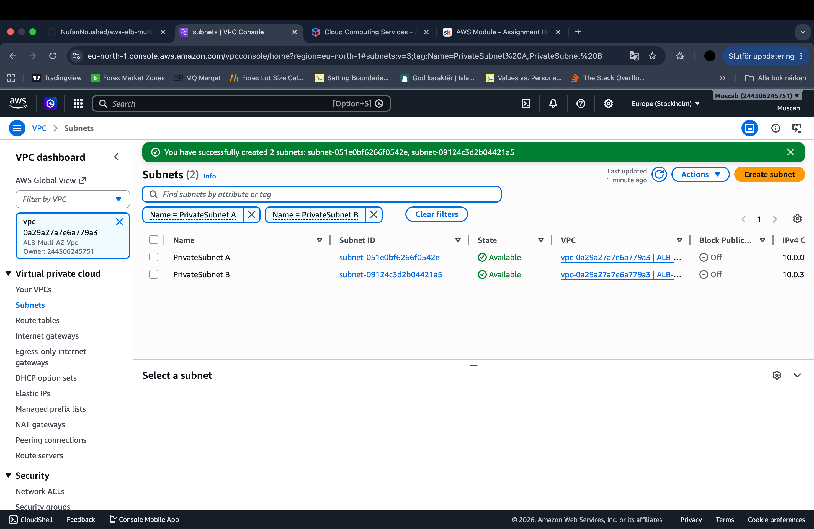

 
---
 
## Step 5 – Internet Gateway Attachment
 
**Purpose**
Enable inbound and outbound internet connectivity for the public subnets.
 
**What was configured**
- Internet Gateway created and attached to `alb-vpc`
**Why this matters**
Required for the public subnets to route traffic to and from the internet at all. This single attachment is what allows both ALB ingress (users reaching the load balancer) and NAT Gateway egress (private instances reaching out for updates).
 
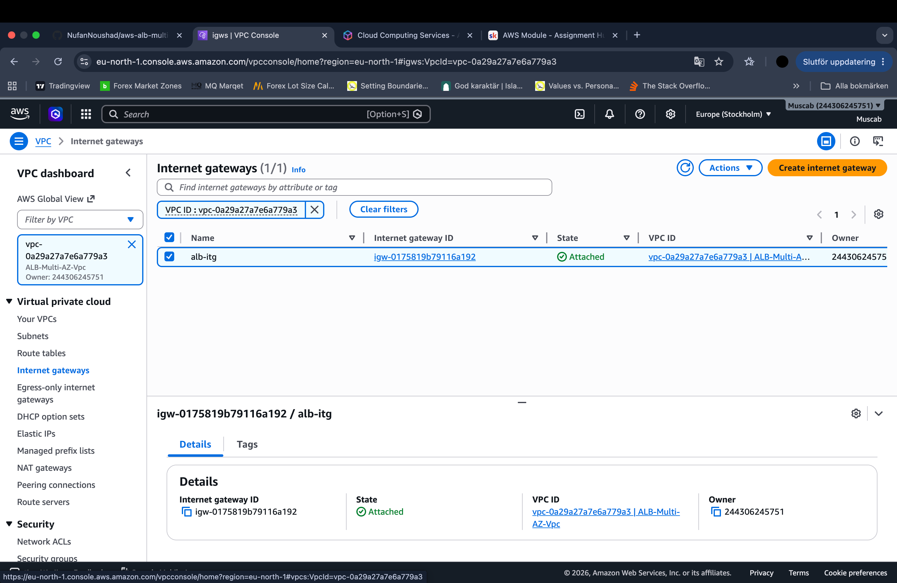
 
---
 
## Step 6 – Public Route Table Configuration
 
**Purpose**
Allow the public subnets to reach the internet via the Internet Gateway.
 
**What was configured**
- Route table with: `0.0.0.0/0 → Internet Gateway`
- Associated with both public subnets
**Why this matters**
A subnet only becomes truly public once its route table sends internet-bound traffic to an Internet Gateway. This route is what makes the ALB and NAT Gateway accessible at all.
 

 
---
 
## Step 7 – Private Route Table Configuration
 
**Purpose**
Prepare a separate route table for the private subnets, enabling controlled outbound connectivity later without exposing inbound access.
 
**What was configured**
- Separate route table created for the private subnets
- Default local route only at this stage
- Updated in Step 10 to route internet-bound traffic via the NAT Gateway
**Why this matters**
Keeping a dedicated route table for the private tier maintains a clean separation from the public route table, so the two tiers can never accidentally share a route to the Internet Gateway.
 
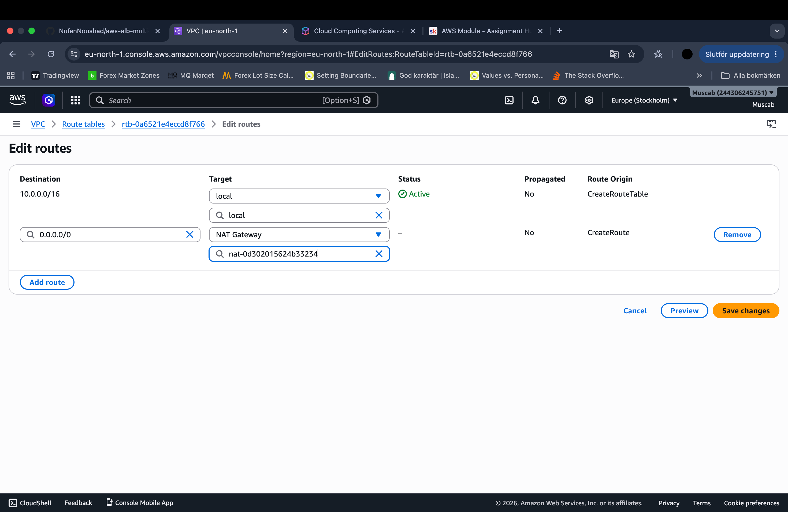
 
---
 
## Step 8 – Elastic IP Allocation
 
**Purpose**
Provide a static public IP address for the NAT Gateway.
 
**What was configured**
- Elastic IP allocated dynamically by AWS
- Reserved for attachment to the NAT Gateway in the next step
**Why this matters**
A NAT Gateway requires a fixed Elastic IP to provide consistent outbound internet access for the private instances — without it, the private subnet's outbound path would have no stable address to route through.
 
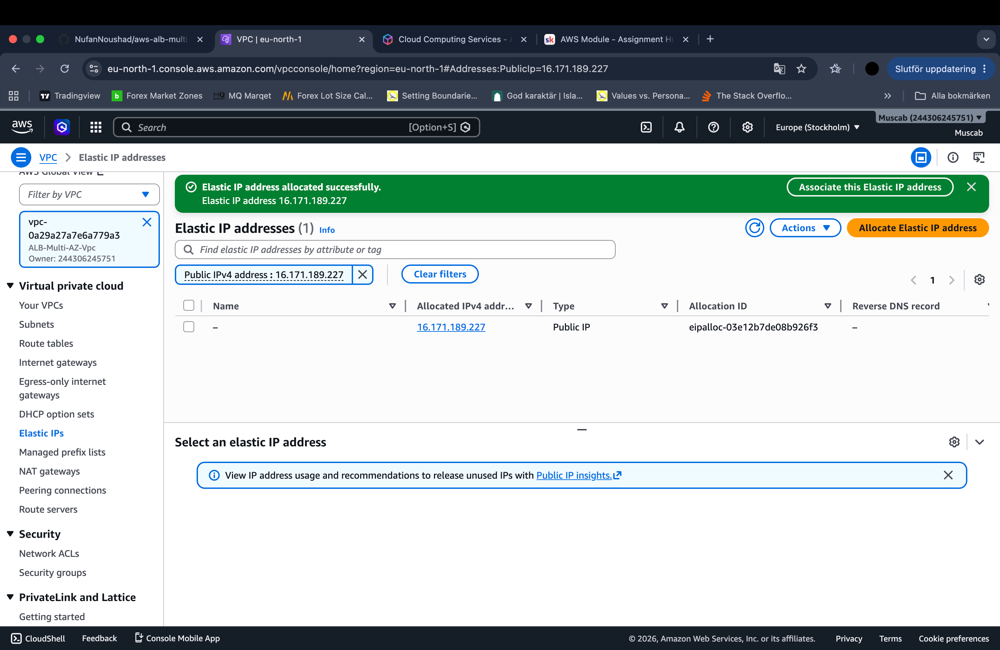
 
---
 
## Step 9 – NAT Gateway Creation
 
**Purpose**
Allow EC2 instances in the private subnets to reach the internet for outbound traffic — package installs and updates — without ever being reachable from the internet themselves.
 
**What was configured**
- NAT Gateway created in the public subnet (AZ-a)
- Elastic IP from Step 8 associated with the NAT Gateway
- NAT Gateway deployed in a single Availability Zone
**Why this matters**
This is the mechanism that lets the user-data script on each private EC2 instance run `yum update` and install Apache successfully, while preserving complete inbound isolation. Outbound only, by design.
 
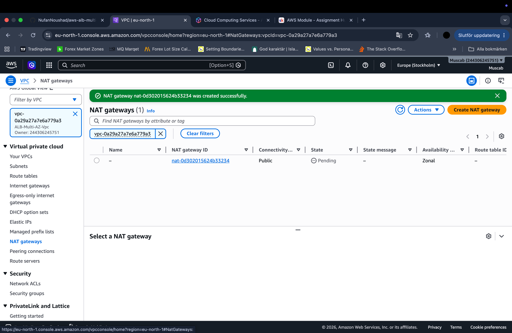
 
---
 
## Step 10 – Private Route Table Update (NAT Routing)
 
**Purpose**
Route outbound internet traffic from the private subnets through the NAT Gateway.
 
**What was configured**
- Private route table updated with: `0.0.0.0/0 → NAT Gateway`
- Route table associated with both private subnets
**Why this matters**
This completes the private subnet's egress path. All outbound traffic from the application instances is now controlled and auditable, while direct inbound exposure remains impossible since no public IP exists on either private instance.
 

 
---
 
## Step 11 – Security Group for the Application Load Balancer
 
**Purpose**
Control inbound and outbound traffic for the internet-facing Application Load Balancer.
 
**What was configured**
- Inbound: HTTP (port 80) from `0.0.0.0/0`
- Outbound: all traffic allowed
**Why this matters**
The ALB is the only component in this architecture designed to be publicly reachable, so it must accept traffic from anywhere by definition. This security group is the first layer of control governing what's allowed to enter the system at all.
 
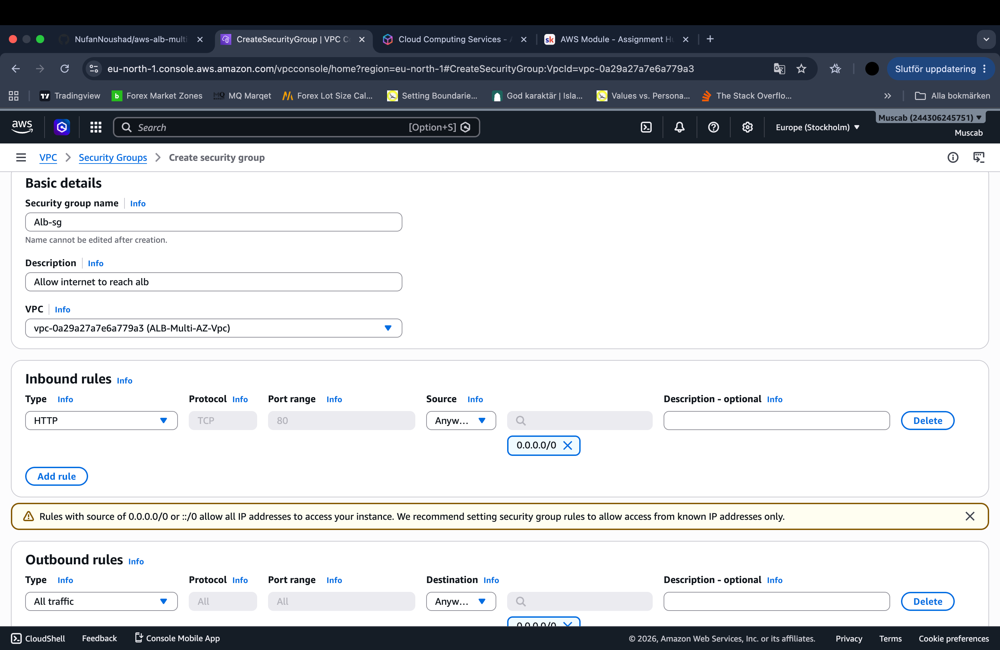
 
---
 
## Step 12 – Security Group for Private EC2 Instances
 
**Purpose**
Restrict inbound access to the EC2 instances so they can only receive traffic that has already passed through the ALB.
 
**What was configured**
- Inbound: HTTP (port 80) — source set to the **ALB security group**, not an IP range
- Outbound: all traffic allowed
**Why this matters**
This enforces identity-based access rather than IP-based rules — the instance trusts traffic based on which security group it came from, not which address. Combined with the private subnet from Step 4, this gives the architecture two independent layers of defence: no public IP to connect to, and a firewall rule that would reject the connection even if one existed.
 
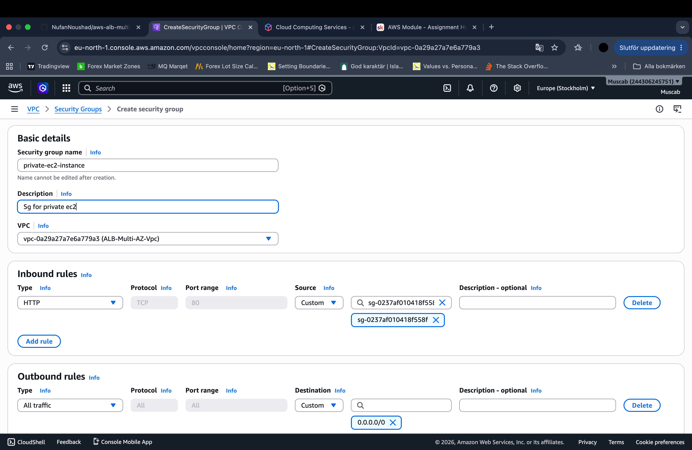
 
---
 
## Step 13 – EC2 Instance Deployment (Private Subnets)
 
**Purpose**
Deploy the application servers in isolated private subnets across multiple Availability Zones.
 
**What was configured**
- Two EC2 instances launched on `t2.micro`
- One instance in the AZ-a private subnet, one in the AZ-b private subnet
- No public IP addresses assigned to either instance
- Apache web server installed automatically via EC2 user data
- Each instance configured to return a unique response (its own instance ID and Availability Zone) for testing
**Why this matters**
Distributing identical instances across two Availability Zones is what makes the architecture highly available — losing one zone does not take the application down. Returning unique content per instance provides a simple, visible way to confirm the load balancer is genuinely distributing traffic rather than always hitting the same server.
 
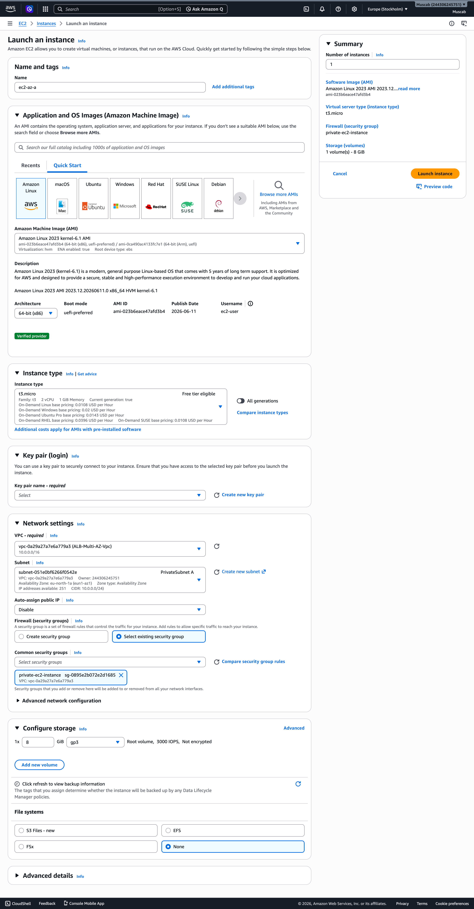

 
---
 
## Step 14 – Target Group Configuration
 
**Purpose**
Group the EC2 instances behind the Application Load Balancer for traffic routing and health monitoring.
 
**What was configured**
- Target type: Instance
- Protocol: HTTP, Port: 80
- Health check path: `/`
- Both EC2 instances registered
**Why this matters**
The target group is the logical bridge between the load balancer and the EC2 instances. Health checks ensure only instances actively responding correctly receive traffic — if an instance fails its health check, the ALB automatically stops routing requests to it with no manual intervention required.
 
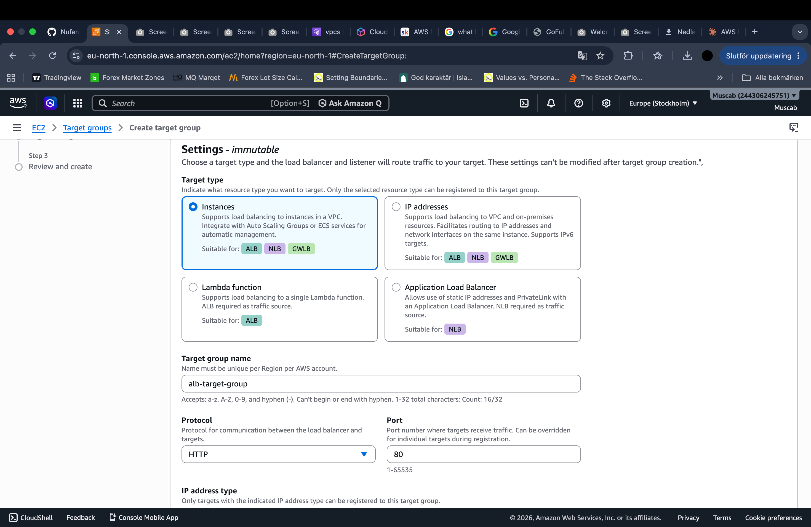
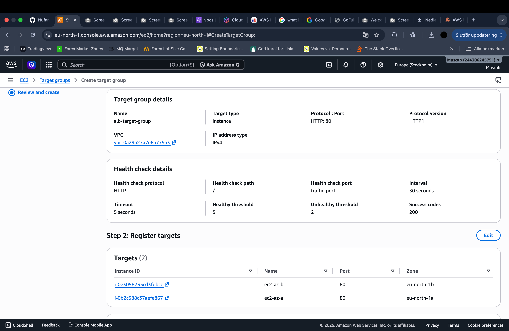
---
 
## Step 15 – Application Load Balancer Creation
 
**Purpose**
Provide a single, highly available entry point for inbound web traffic.
 
**What was configured**
- Internet-facing Application Load Balancer
- Deployed across both public subnets (AZ-a and AZ-b)
- Listener on HTTP port 80
- Forwarding rules pointing to the target group
**Why this matters**
The ALB eliminates any single point of failure at the entry point of the application. By spanning both Availability Zones, the load balancer itself remains reachable even if one entire zone becomes unavailable.
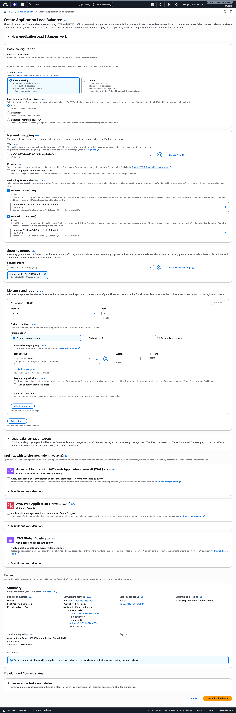
 
---

## Step 16 – Validation and Testing
 
**Purpose**
Verify that load balancing and high availability are functioning correctly.
 
**What was validated**
- Refreshing the ALB DNS endpoint in a browser alternates the response between EC2 Web-A and EC2 Web-B
- Terminating one EC2 instance manually did not cause downtime — the remaining healthy instance continued serving all traffic
- Target group health checks updated automatically

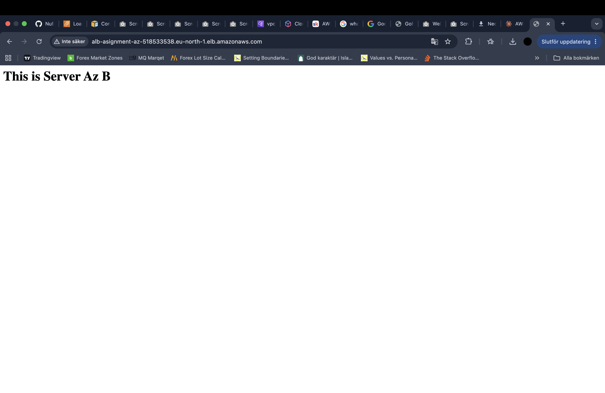
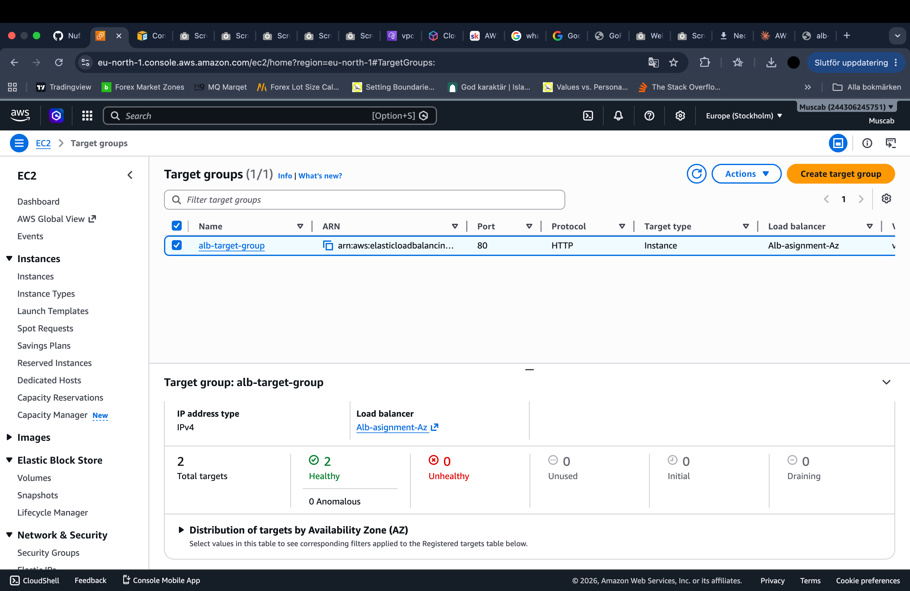

